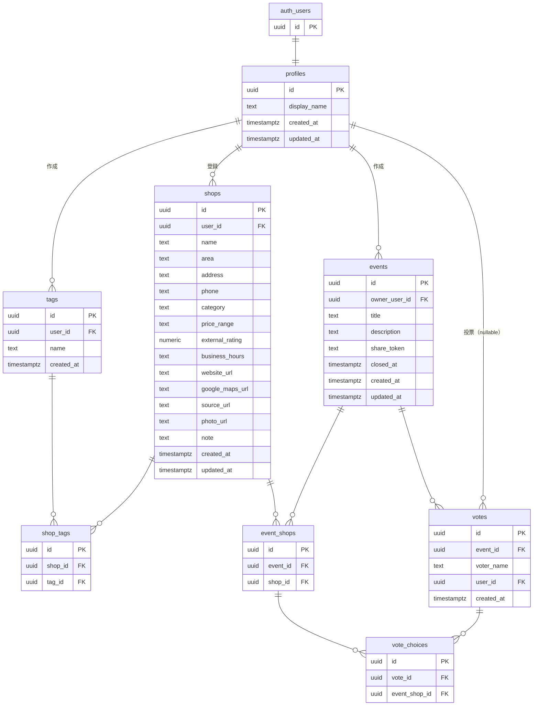

# DB設計

**サービス名:** Tokoco（トココ）
**バージョン:** 1.0
**作成日:** 2026-03-26
**ステータス:** Draft

---

## テーブル一覧

| テーブル名 | 概要 |
|---|---|
| profiles | ユーザープロフィール（Supabase Auth の users と 1:1） |
| shops | 店舗 |
| tags | タグマスタ |
| shop_tags | 店舗とタグの紐付け |
| events | イベント |
| event_shops | イベントの候補店舗 |
| votes | 投票 |
| vote_choices | 投票の選択内容 |

---

## ER図



---

## DDL

### profiles

```sql
create table public.profiles (
  id          uuid primary key references auth.users(id) on delete cascade,
  display_name text not null,
  created_at  timestamptz not null default now(),
  updated_at  timestamptz not null default now()
);
```

#### profiles 自動作成 Trigger

会員登録時（`auth.users` への INSERT）に `profiles` レコードを自動生成する（AUTH-04）。
`display_name` は登録フォームから `raw_user_meta_data` に含めて渡す。

```sql
create or replace function public.handle_new_user()
returns trigger
language plpgsql
security definer set search_path = public
as $$
begin
  insert into public.profiles (id, display_name)
  values (
    new.id,
    coalesce(new.raw_user_meta_data->>'display_name', '名無し')
  );
  return new;
end;
$$;

create trigger on_auth_user_created
  after insert on auth.users
  for each row execute function public.handle_new_user();
```

### shops

```sql
create table public.shops (
  id              uuid primary key default gen_random_uuid(),
  user_id         uuid not null references public.profiles(id) on delete cascade,
  name            text not null,
  area            text,
  address         text,
  phone           text,
  category        text,
  price_range     text check (price_range in ('〜¥999', '¥1,000〜¥2,999', '¥3,000〜¥5,999', '¥6,000〜¥9,999', '¥10,000〜', '価格帯不明')),  -- 外部 7.1 の変換ルールに準拠
  external_rating numeric(3, 1),       -- e.g. 4.2
  business_hours  text,                -- Google weekday_text を改行区切りで保存
  website_url     text,
  google_maps_url text,
  source_url      text,                -- URL入力時の登録元URL
  photo_url       text,
  note            text,
  created_at      timestamptz not null default now(),
  updated_at      timestamptz not null default now()
);
```

### tags

```sql
create table public.tags (
  id         uuid primary key default gen_random_uuid(),
  user_id    uuid not null references public.profiles(id) on delete cascade,
  name       text not null,
  created_at timestamptz not null default now(),
  unique (user_id, name)               -- 同一ユーザーで同名タグの重複を防止
);
```

### shop_tags

```sql
create table public.shop_tags (
  id      uuid primary key default gen_random_uuid(),
  shop_id uuid not null references public.shops(id) on delete cascade,
  tag_id  uuid not null references public.tags(id) on delete cascade,
  unique (shop_id, tag_id)             -- 同一店舗への同タグ重複付与を防止
);
```

### events

```sql
create table public.events (
  id             uuid primary key default gen_random_uuid(),
  owner_user_id  uuid not null references public.profiles(id) on delete cascade,
  title          text not null,
  description    text,
  share_token    text not null unique, -- 128bit 以上のエントロピーで生成（SEC-07）
  closed_at      timestamptz,          -- null = オープン中
  created_at     timestamptz not null default now(),
  updated_at     timestamptz not null default now()
);
```

### event_shops

```sql
create table public.event_shops (
  id       uuid primary key default gen_random_uuid(),
  event_id uuid not null references public.events(id) on delete cascade,
  shop_id  uuid not null references public.shops(id) on delete cascade,
  unique (event_id, shop_id)           -- 同一イベントへの同店舗重複追加を防止
);
```

### votes

```sql
create table public.votes (
  id         uuid primary key default gen_random_uuid(),
  event_id   uuid not null references public.events(id) on delete cascade,
  voter_name text not null,            -- ゲストは入力値、会員は display_name を使用
  user_id    uuid references public.profiles(id) on delete set null,  -- 会員の場合のみ。退会時に NULL に更新
  created_at timestamptz not null default now()
);
```

### vote_choices

```sql
create table public.vote_choices (
  id            uuid primary key default gen_random_uuid(),
  vote_id       uuid not null references public.votes(id) on delete cascade,
  event_shop_id uuid not null references public.event_shops(id) on delete cascade,
  unique (vote_id, event_shop_id)      -- 1票で同一候補への重複選択を防止
);
```

#### 退会時の voter_name 匿名化 Trigger

アカウント削除時に `votes.voter_name` を「退会済みユーザー」に更新する（AUTH-15）。
`profiles` の BEFORE DELETE で実行し、その後 FK の `on delete set null` が `votes.user_id` を NULL にする。

```sql
create or replace function public.handle_user_delete()
returns trigger
language plpgsql
security definer set search_path = public
as $$
begin
  update public.votes
  set voter_name = '退会済みユーザー'
  where user_id = old.id;
  return old;
end;
$$;

create trigger on_profile_deleted
  before delete on public.profiles
  for each row execute function public.handle_user_delete();
```

---

## インデックス

```sql
-- shops: ユーザーの店舗一覧取得・フィルタリング
create index idx_shops_user_id         on public.shops(user_id);
create index idx_shops_user_category   on public.shops(user_id, category);
create index idx_shops_user_price      on public.shops(user_id, price_range);
create index idx_shops_user_area       on public.shops(user_id, area);

-- tags: ユーザーのタグ候補表示
create index idx_tags_user_id          on public.tags(user_id);

-- shop_tags: タグによる店舗絞り込み
create index idx_shop_tags_shop_id     on public.shop_tags(shop_id);
create index idx_shop_tags_tag_id      on public.shop_tags(tag_id);

-- events: ユーザーのイベント一覧取得
create index idx_events_owner_user_id  on public.events(owner_user_id);

-- events: 共有リンクのトークン検索
create index idx_events_share_token    on public.events(share_token);

-- event_shops: イベントの候補店舗取得
create index idx_event_shops_event_id  on public.event_shops(event_id);

-- votes: イベントの投票一覧取得
create index idx_votes_event_id        on public.votes(event_id);

-- vote_choices: 投票の選択内容取得・集計
create index idx_vote_choices_vote_id       on public.vote_choices(vote_id);
create index idx_vote_choices_event_shop_id on public.vote_choices(event_shop_id);
```

---

## RLS ポリシー

### profiles

```sql
alter table public.profiles enable row level security;

-- 本人のみ参照・更新
create policy "profiles: select own" on public.profiles
  for select using (auth.uid() = id);

create policy "profiles: update own" on public.profiles
  for update using (auth.uid() = id);
```

### shops

```sql
alter table public.shops enable row level security;

create policy "shops: select own" on public.shops
  for select using (auth.uid() = user_id);

create policy "shops: insert own" on public.shops
  for insert with check (auth.uid() = user_id);

create policy "shops: update own" on public.shops
  for update using (auth.uid() = user_id);

create policy "shops: delete own" on public.shops
  for delete using (auth.uid() = user_id);
```

### tags

```sql
alter table public.tags enable row level security;

create policy "tags: select own" on public.tags
  for select using (auth.uid() = user_id);

create policy "tags: insert own" on public.tags
  for insert with check (auth.uid() = user_id);

create policy "tags: delete own" on public.tags
  for delete using (auth.uid() = user_id);
```

### shop_tags

```sql
alter table public.shop_tags enable row level security;

-- shop の所有者のみ操作可
create policy "shop_tags: select own" on public.shop_tags
  for select using (
    exists (select 1 from public.shops where shops.id = shop_tags.shop_id and shops.user_id = auth.uid())
  );

create policy "shop_tags: insert own" on public.shop_tags
  for insert with check (
    exists (select 1 from public.shops where shops.id = shop_tags.shop_id and shops.user_id = auth.uid())
  );

create policy "shop_tags: delete own" on public.shop_tags
  for delete using (
    exists (select 1 from public.shops where shops.id = shop_tags.shop_id and shops.user_id = auth.uid())
  );
```

### events

```sql
alter table public.events enable row level security;

-- オーナーのみ操作可
create policy "events: insert own" on public.events
  for insert with check (auth.uid() = owner_user_id);

create policy "events: update own" on public.events
  for update using (auth.uid() = owner_user_id);

create policy "events: delete own" on public.events
  for delete using (auth.uid() = owner_user_id);

-- オーナーのみ参照可
-- ゲストアクセス（share_token 検証）は Route Handler が service_role で行う
create policy "events: select own" on public.events
  for select using (auth.uid() = owner_user_id);
```

### event_shops

```sql
alter table public.event_shops enable row level security;

-- オーナーのイベントに紐づく候補店舗のみ参照可
-- ゲストアクセスは Route Handler が service_role で行う
create policy "event_shops: select own" on public.event_shops
  for select using (
    exists (select 1 from public.events where events.id = event_shops.event_id and events.owner_user_id = auth.uid())
  );

create policy "event_shops: insert own" on public.event_shops
  for insert with check (
    exists (select 1 from public.events where events.id = event_shops.event_id and events.owner_user_id = auth.uid())
  );

create policy "event_shops: delete own" on public.event_shops
  for delete using (
    exists (select 1 from public.events where events.id = event_shops.event_id and events.owner_user_id = auth.uid())
  );
```

### votes / vote_choices

```sql
alter table public.votes enable row level security;
alter table public.vote_choices enable row level security;

-- 投票 INSERT・vote_choices INSERT は Route Handler が service_role で行う
-- （オープン中かどうかの検証も Route Handler 側で実施）
-- RLS は参照のみ定義し、オーナーのみに限定する

-- 参照はオーナーのみ
create policy "votes: select own event" on public.votes
  for select using (
    exists (select 1 from public.events where events.id = votes.event_id and events.owner_user_id = auth.uid())
  );

create policy "vote_choices: select own event" on public.vote_choices
  for select using (
    exists (
      select 1 from public.votes
      join public.events on events.id = votes.event_id
      where votes.id = vote_choices.vote_id and events.owner_user_id = auth.uid()
    )
  );
```

---

## 補足

- `updated_at` の自動更新は Supabase の `moddatetime` 拡張または Trigger で実装する
- `share_token` は Route Handler 側で `crypto.randomUUID()` 等を用いて生成し、128bit 以上のエントロピーを確保する（SEC-07）
- ゲストアクセス（イベント・候補店舗の参照）および投票の INSERT は、Route Handler が service_role で share_token を検証した上で処理する。anon ロールからの直接アクセスは RLS で遮断する（SEC-06）
- アカウント削除時、`votes.voter_name` は `on_profile_deleted` Trigger で「退会済みユーザー」に更新し、その後 FK の `on delete set null` により `votes.user_id` が NULL になる（AUTH-15）
